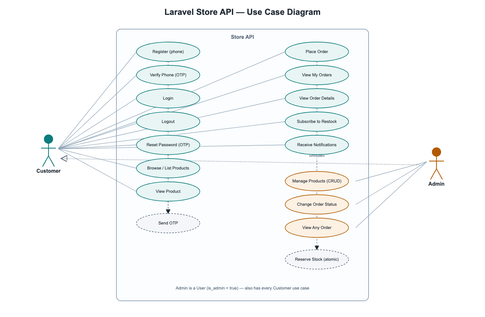
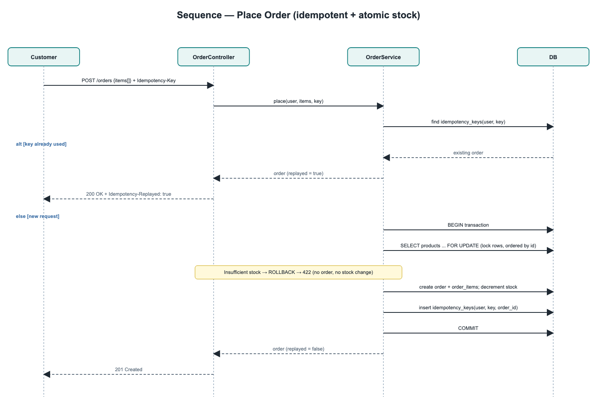

# Store API

A REST-only backend for a small online store, built with **Laravel 13**. It provides
phone-number authentication, admin product management with image upload, a queue-backed
notification system (database + SMS), and concurrency-safe order processing with a full
status workflow.

---

## Requirements

- PHP **8.3+** with BCMath, Mbstring, and the PDO driver for your database
- Composer 2
- SQLite with `pdo_sqlite` for local development and the fast test suite

The stack is database-driven for queues, cache, and notifications, so no additional service
is required locally. MySQL and PostgreSQL are supported production databases; install their
matching PDO extension.

Product image code explicitly reads and writes the disk named `public`. Locally that disk
uses `storage/app/public`, exposed by `php artisan storage:link`. Changing only
`FILESYSTEM_DISK` does not redirect product images. A production deployment that needs
shared/object storage must configure the `public` disk itself with the appropriate driver,
credentials, public URL, and visibility.

---

## Setup

```bash
# 1. Install dependencies
composer install

# 2. Environment
cp .env.example .env
php artisan key:generate

# 3. Database (SQLite) + seed the admin account and a sample product catalogue
touch database/database.sqlite
php artisan migrate --seed

# 4. Storage symlink so uploaded product images are publicly served
php artisan storage:link
```

### Running

```bash
# API server
php artisan serve                 # http://localhost:8000

# Queue worker — REQUIRED for notifications to be delivered
php artisan queue:work

# Local scheduler worker — runs scheduled maintenance
php artisan schedule:work
```

Notifications (new product, back-in-stock, order status) are dispatched to the **database
queue** and processed by the worker, so they never delay an API response. If you don't run
`queue:work`, the API still works but queued notifications stay pending.

In production, keep at least one queue worker under a process supervisor and invoke
`php artisan schedule:run` every minute from cron (or use an equivalent scheduler). The
application runs `model:prune` daily, removing OTP records older than one day. Without the
scheduler, these spent or expired rows accumulate. It also runs
`product-images:cleanup --limit=500` every five minutes to retry filesystem deletions that
could not be completed after a successful product update or delete.

### Tests

```bash
php artisan test
```

The fast suite runs against an in-memory SQLite database (configured in `phpunit.xml`,
which also forces `SMS_SENDER=log` regardless of your local `.env`, so the suite never
makes a real Twilio call) and is fully self-contained.

GitHub Actions runs Composer validation and the locked-dependency security audit, Pint,
and the full SQLite suite on every push and pull request. Dedicated MySQL 8 and PostgreSQL
16 jobs first run the production concurrency tests with two independent PHP processes,
including competing multi-unit orders for the same product, then run the complete suite
against that database engine.

---

## Seeding

`php artisan migrate --seed` (or `php artisan db:seed`) runs both seeders:

| Seeder | What it creates | Re-run behaviour |
| --- | --- | --- |
| `AdminUserSeeder` | One admin account, already phone-verified (see table below) | Idempotent — `updateOrCreate` by phone |
| `ProductSeeder` | 6 realistic products, one of them out of stock | Skips entirely if any product already exists |

Run a single seeder on its own (e.g. after a `migrate:fresh`, or to add the catalogue to a
database that only has the admin):

```bash
php artisan db:seed --class=AdminUserSeeder
php artisan db:seed --class=ProductSeeder
```

`ProductSeeder` is a fixed 6-row catalogue meant for manual/Postman testing, not bulk data.
To generate more for pagination testing, use the factory directly:

```bash
php artisan tinker --execute="App\Models\Product::factory()->count(50)->create();"
```

### Seeded admin

| Field | Env var | Default |
| --- | --- | --- |
| Phone | `ADMIN_SEED_PHONE` | `+10000000001` |
| Password | `ADMIN_SEED_PASSWORD` | `password` |

The admin is created already phone-verified, so you can log in immediately and receive a
token.

---

## Authentication flow

Authentication uses **Laravel Sanctum** bearer tokens. The account identity is the phone
number.

1. `POST /api/auth/register` — creates the account and sends a 6-digit sign-up code.
2. The code is delivered through the configured SMS gateway (see **SMS delivery** below).
3. `POST /api/auth/verify-phone` — confirms the phone. Login is blocked until this is done.
4. `POST /api/auth/login` — returns a token. Send it as `Authorization: Bearer <token>` on
   protected routes.
5. `GET /api/auth/me` — fetch the authenticated user's own profile.
6. `POST /api/auth/logout` — revokes only the token used on the request.
   `POST /api/auth/logout-all` — revokes every token for the user (all devices/sessions).

Forgot your password? `POST /api/auth/password/forgot` sends a reset code, then
`POST /api/auth/password/reset` sets a new password and revokes all existing tokens.

### Authentication rate limits

Abuse-sensitive operations are limited independently by a privacy-safe client-source key
and a one-way-derived normalized phone key:

| Operation | Limit |
| --- | --- |
| Login | 5 attempts per minute per source and phone |
| Verification/registration/password-reset code issue | 3 per 10 minutes per phone and purpose, plus a 20-per-minute source ceiling |
| Verification and password-reset code attempt | 5 per minute per source and phone/purpose |

An exhausted bucket returns `429` with `Retry-After`, rate-limit headers, and
`{"message":"Too many attempts. Please try again later."}`. Public code-request and
forgot-password responses remain the same for known and unknown phone numbers, including
when throttled. A confirmed SMS-provider failure does not consume the phone-specific
three-attempt allowance, but it still consumes the independent 20-per-minute source
ceiling. Successful public resend/recovery responses include `Retry-After: 60` so clients
do not immediately repeat a request when no message arrives.

### SMS delivery

`App\Services\Sms\SmsSender` is a swappable interface, selected by `SMS_SENDER` in `.env`:

| `SMS_SENDER` | Driver | Behaviour |
| --- | --- | --- |
| `log` (default) | `LogSmsSender` | Writes the message to `storage/logs/laravel.log` (look for `SMS dispatched`) — zero external dependency, used automatically in tests. |
| `twilio` | `TwilioSmsSender` | Sends a real SMS via the Twilio REST API. Requires `TWILIO_SID`, `TWILIO_AUTH_TOKEN`, `TWILIO_FROM_NUMBER` in `.env` (see `.env.example`). A [free trial account](https://www.twilio.com/try-twilio) can only send to phone numbers you've verified in the Twilio console, and every message is prefixed with a "Sent from your Twilio trial account" notice by Twilio itself until the account is upgraded — that prefix isn't something this app controls. |

Add another provider by implementing `SmsSender` and registering it in the `match` in
`App\Providers\AppServiceProvider`.

The SMS **wording** differs by purpose (`App\Enums\OtpPurpose::smsLabel()`): a sign-up code
and a password-reset code read differently, so a customer can't confuse the two texts.

OTP delivery is tracked explicitly. A new row starts pending, becomes redeemable only after
the sender returns successfully, and is immediately expired and marked failed if Twilio (or
another sender) throws. Registration returns a generic `503` with `Retry-After: 60` when
that happens while retaining the unverified account for a later resend. Public verification
resend and forgot-password routes keep their generic `200` bodies to avoid exposing which
phone numbers have accounts; provider details are never returned.

Notifications (order status changes, back-in-stock alerts) are also texted — best-effort,
only to users with a verified phone, through the same `SmsSender` (see **Notifications**
below). New-product broadcasts stay database-only on purpose: they go to every verified
customer, and turning that into an SMS blast would be spam (and burn Twilio trial credit).

---

## API endpoints

All endpoints are under `/api` and return JSON. Protected routes require
`Authorization: Bearer <token>`.

### Auth
| Method | Endpoint | Auth | Description |
| --- | --- | --- | --- |
| POST | `/auth/register` | – | Register with a phone number |
| POST | `/auth/login` | – | Get a bearer token |
| GET | `/auth/me` | ✔ | The authenticated user's own profile |
| POST | `/auth/logout` | ✔ | Revoke the current token |
| POST | `/auth/logout-all` | ✔ | Revoke every token for the user |
| POST | `/auth/verify-phone/request` | – | Send/resend a verification code |
| POST | `/auth/verify-phone` | – | Verify the phone number |
| POST | `/auth/password/forgot` | – | Send a password reset code |
| POST | `/auth/password/reset` | – | Reset the password |

### Products
| Method | Endpoint | Auth | Description |
| --- | --- | --- | --- |
| GET | `/products` | ✔ | List products (search, price/stock filters, sort, pagination) |
| GET | `/products/{id}` | ✔ | Show a product |
| POST | `/products` | admin | Create a product (multipart, with image) |
| PUT/PATCH | `/products/{id}` | admin | Update a product |
| DELETE | `/products/{id}` | admin | Delete a product |
| POST | `/products/{id}/notify-me` | ✔ | Subscribe to a back-in-stock alert (out-of-stock only) |

### Orders
| Method | Endpoint | Auth | Description |
| --- | --- | --- | --- |
| GET | `/orders` | ✔ | List orders (own for users, all for admin; status/user filters, sort) |
| GET | `/orders/{id}` | owner/admin | Show an order (404 for a non-owner, non-admin) |
| POST | `/orders` | ✔ | Place an order (optional `Idempotency-Key` header) |
| PATCH | `/orders/{id}/status` | admin | Change order status (cancelling restocks the items) |

### Notifications
| Method | Endpoint | Auth | Description |
| --- | --- | --- | --- |
| GET | `/notifications` | ✔ | The user's own notifications (same `data`/`links`/`meta` pagination shape as products/orders) |
| PATCH | `/notifications/{id}/read` | ✔ | Mark a notification as read |

A runnable request collection with representative success and error responses is in the
Postman collection at
[`docs/postman_collection.json`](docs/postman_collection.json). Import it into Postman and
set the `base_url`, `token`, and `admin_token` collection variables.

The authoritative transaction, locking, fingerprint, and OTP-claim diagrams are kept as
renderable Mermaid source in [`docs/reliability.md`](docs/reliability.md). The exact changed
HTTP behaviors are also recorded in the
[`P0 reliability contract`](specs/001-api-reliability-hardening/contracts/api-contract.md)
and the
[`resilience-completion contract`](specs/002-api-resilience-completion/contracts/api-contract.md).
The OTP outage, description boundary, and database-error behavior is defined in the
[`OTP delivery resilience contract`](specs/003-otp-delivery-resilience/contracts/api-contract.md).

### Order idempotency

`Idempotency-Key` values may be at most 64 characters. Repeating a key with the same
normalized product IDs and quantities returns the original order with `200` and
`Idempotency-Replayed: true`, even if item lines were reordered. Reusing that key for a
different normalized order returns `409` with
`{"message":"The idempotency key was already used with a different request."}` and does
not change orders or stock. Keys longer than 64 characters return the standard `422`
validation response.

### Listing query validation

Product and order listing parameters are validated before a query is built. Bad numeric,
boolean, enum, sorting, or pagination values return Laravel's standard `422` JSON
validation envelope instead of being silently cast or clamped.

| Listing | Accepted query values |
| --- | --- |
| Products | `search` up to 200 characters; non-negative `min_price`/`max_price` with `max_price >= min_price`; boolean `in_stock`; `sort=price\|title\|created_at`; `direction=asc\|desc`; `per_page=1..100`; `page>=1` |
| Orders | a defined order `status`; admin-only existing `user_id`; `sort=created_at\|total`; `direction=asc\|desc`; `per_page=1..100`; `page>=1` |

Product `description` accepts at most 1,000 characters on both create and update. A longer
value returns the standard `422` validation envelope and does not mutate the product.

---

## Diagrams

> 📬 **Postman collection:** [`docs/postman_collection.json`](docs/postman_collection.json) — import it into
> Postman to exercise every endpoint above (variables: `base_url`, `token`, `admin_token`).
>
> The PNG diagrams below are high-level overview snapshots and intentionally omit some
> secondary endpoints and reliability branches. For the current `request_hash`, matching
> replay versus `409` conflict, atomic OTP claim, and locked status-transition flows, use
> the authoritative Mermaid diagrams in [`docs/reliability.md`](docs/reliability.md).

### Entity-relationship overview
All 9 domain tables and how they connect: `users` and `products` as the two hubs,
`orders` as the central transaction, `order_items`/`stock_subscriptions` as the
many-to-many join tables, `idempotency_keys`/`order_status_histories` hanging off
`orders`, and `otp_codes` linked to `users` only by the `phone` value (no FK). This snapshot
does not show the later `idempotency_keys.request_hash` column; the current reliability
schema is in [`docs/reliability.md`](docs/reliability.md#reliability-data-model).


### Use case diagram
Customer and Admin actors against the Store API, including `«include»` relationships
(registration/password-reset both include *Send OTP*; *Place Order* includes the atomic
*Reserve Stock* step) and the Admin-is-a-User generalization.



### User flow
The end-to-end customer journey: register → verify phone (OTP, with retry) → login →
browse → place an order → atomic stock check → order created → status notifications,
with the out-of-stock/restock-subscription branch, the idempotent-retry branch, and the
password-reset side flow.


### Sequence — registration & phone verification (OTP)
Customer → `AuthController` → `OtpService` → `SmsSender` → DB, from account creation
through code delivery and verification, including the rate-limit/no-existence-leak note.


### Sequence overview — place order (idempotent + atomic stock)
Customer → `OrderController` → `OrderService` → DB. Shows the `alt [key already used] /
else [new request]` idempotency branch, the `SELECT ... FOR UPDATE` row lock, and the
rollback-on-insufficient-stock path. This older snapshot does not distinguish a matching
fingerprint replay from a mismatched `409`; the current sequence is in
[`docs/reliability.md`](docs/reliability.md#order-placement-and-idempotency).



---

## Design decisions

### Events, Listeners and Observers
The domain uses each Laravel primitive where it fits best:

| Primitive | Where | Why |
| --- | --- | --- |
| **Observer** | `ProductObserver@updated` | Detects the out-of-stock → in-stock transition from a normal product update. Detection belongs to the model lifecycle, so an observer is the natural home; it holds *only* detection and raises `ProductRestocked`. |
| **Event + Listener** | `ProductCreated` → `SendNewProductNotifications` | Notify all verified customers of a new product, off the request cycle. |
| **Event + Listener** | `ProductRestocked` → `SendBackInStockNotifications` | Notify only the subscribers of a restocked product. |
| **Event + Listener** | `OrderStatusChanged` → `SendOrderStatusNotification` | Notify the order owner when their order's status changes. |

All listeners are `ShouldQueue` + `afterCommit`.

### Notifications never block or corrupt the response
- Every fan-out runs on a **queued** listener dispatched **after** the database
  transaction commits, so the API response returns immediately and a notification failure
  can never roll back the product/order operation.
- **Retries and concurrent workers are safe.** Every logical recipient/event pair receives
  a deterministic notification UUID. The database notification insert is the atomic
  deduplication claim; a duplicate primary-key insert is a clean no-op.
- Notifications that also use SMS write the database notification first. A duplicate
  worker therefore stops before the SMS channel, while a first delivery can continue to
  SMS. Back-in-stock subscriptions are deleted only after this durable delivery succeeds;
  a retryable database failure preserves the subscription.
- **Back-in-stock and order-status notifications also send an SMS** (`App\Notifications\Channels\SmsChannel`),
  best-effort: a gateway failure is logged (`SMS notification delivery failed`) and does
  **not** fail the queued job or the database notification that already succeeded. Only
  sent to a user with a verified phone.

### Stock integrity & concurrency
- Order creation runs in a single transaction that locks the product rows with
  `lockForUpdate` (in a stable id order to avoid deadlocks). The read → check → decrement
  is serialised, so stock can never be oversold.
- It is **all-or-nothing**: if any requested quantity is short, the whole transaction rolls
  back — no order, no items, no partial stock change (`422 Insufficient stock.`).
- Row-level locking is enforced on MySQL/Postgres. The production concurrency test launches
  two independent PHP processes behind a shared barrier. It proves both that one remaining
  unit creates exactly one order and that two buyers each requesting two units from stock of
  three produce one order, one `422`, and final stock of one. SQLite stays the fast
  development/test path and skips these engine-specific proofs.
- **Unit price is snapshotted** on each order item, so later product price edits never
  change an existing order's totals. Money is computed with bcmath.
- **Cancelling an order restocks its items**, in the same transaction as the status change
  and the same locked-row-order discipline as placing an order. Restocking a product from 0
  correctly re-triggers `ProductObserver` → `ProductRestocked` → back-in-stock notifications.

### OTP security
- Codes are 6 digits, generated with a CSPRNG, **stored only as a bcrypt hash**, single-use,
  and expire after `OTP_TTL_MINUTES` (default 10). Issuing a new code expires and explicitly
  supersedes every prior usable code for the same phone/purpose. Only delivered codes are
  redeemable; pending, failed, superseded, consumed, and expired codes are rejected. Codes
  remain scoped by purpose (a verification code can't reset a password). The plain code is
  returned by **no** API response.
- OTP issuance and redemption use the privacy-safe limits documented above. Request and
  forgot-password endpoints return an identical response whether or not the phone exists,
  so they cannot be used to enumerate accounts.

### Order status workflow
- Allowed transitions: `pending → confirmed → processing → shipped → delivered`, with
  `cancelled` reachable from `pending`, `confirmed`, or `processing` — **not** from
  `shipped`, since the package is already with a carrier by then. `delivered` and
  `cancelled` are terminal. Illegal transitions return `422`.
- **Resubmitting the current status is a no-op**: no history row, no event, no notification.
- Every real change writes an immutable history row (`from`, `to`, `changed_by`,
  `created_at`) in the same transaction as the status update.

### Authorization
- Sanctum protects every non-public route (`401` when unauthenticated).
- `ProductPolicy` restricts writes to admins; `OrderPolicy` restricts an order to its owner
  or an admin, and status changes to admins.
- Viewing another user's order returns **404**, not 403 — the order's existence is not
  confirmable by a non-owner. Attempting an admin-only *action* (e.g. a status change) as a
  regular user still returns 403, since that failure isn't about hiding a resource's
  existence.

### Product image failure safety

- New images are stored before the catalogue transaction. If persistence fails, the new
  file is compensated and the previous product/image state remains unchanged.
- Replaced or deleted image paths are recorded in `pending_file_deletions` inside the same
  transaction as the product mutation. Deletion is attempted after commit, so a failed
  database write can never remove an image that the database still references.
- A failed filesystem delete remains durable cleanup work for the scheduled
  `product-images:cleanup` command. Cleanup is idempotent: an already-missing file is success.

### Assumptions
- Admins are provisioned by seeding, not via a public endpoint.
- `notify-me` (back-in-stock subscription) only accepts out-of-stock products; subscribing
  to an in-stock product is a `422`.

---

## Project layout highlights

```
app/
  Enums/            OrderStatus (transition map), OtpPurpose (SMS wording per purpose)
  Events/           ProductCreated, ProductRestocked, OrderStatusChanged
  Listeners/        queued notification fan-out (one per event)
  Observers/        ProductObserver (restock detection)
  Notifications/    database + SMS notifications
    Channels/       SmsChannel (routes a notification's toSms() through SmsSender)
  Policies/         ProductPolicy, OrderPolicy
  Services/
    Notifications/  deterministic database-backed delivery deduplication
    Products/       failure-safe image persistence and cleanup compensation
    Sms/            SmsSender contract + LogSmsSender/TwilioSmsSender (swappable gateway)
    Otp/            OtpService (hashing, expiry, rate limiting, purpose-specific wording)
    Orders/         OrderService (atomic stock), OrderStatusService (transitions, cancel-restock)
  Support/Database/ precise cross-database duplicate-key classification
app/Console/Commands/CleanupProductImages.php
database/seeders/   AdminUserSeeder, ProductSeeder
config/store.php    OTP, SMS-sender/Twilio, and admin-seed settings
docs/postman_collection.json
docs/reliability.md       authoritative reliability diagrams and verification limits
```
