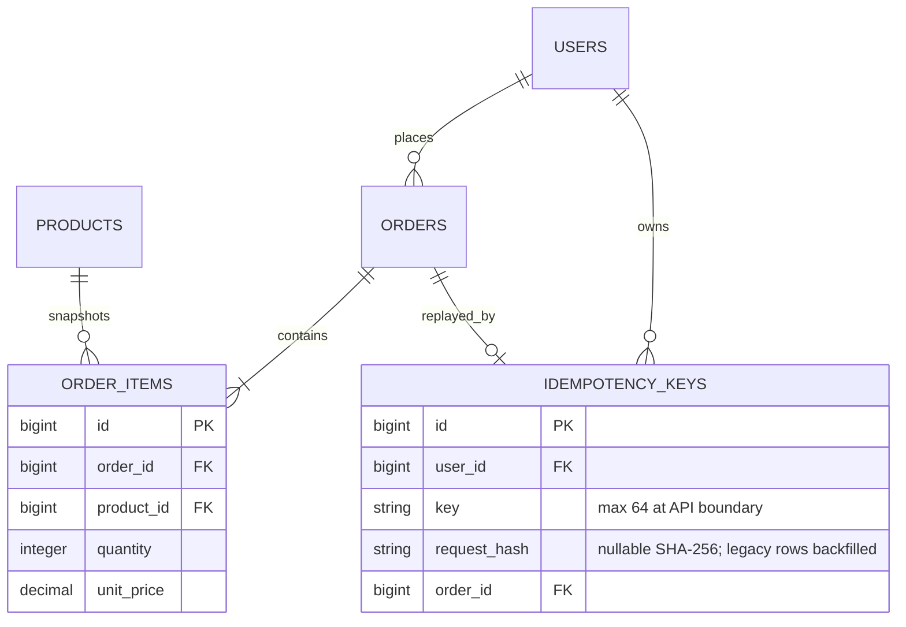
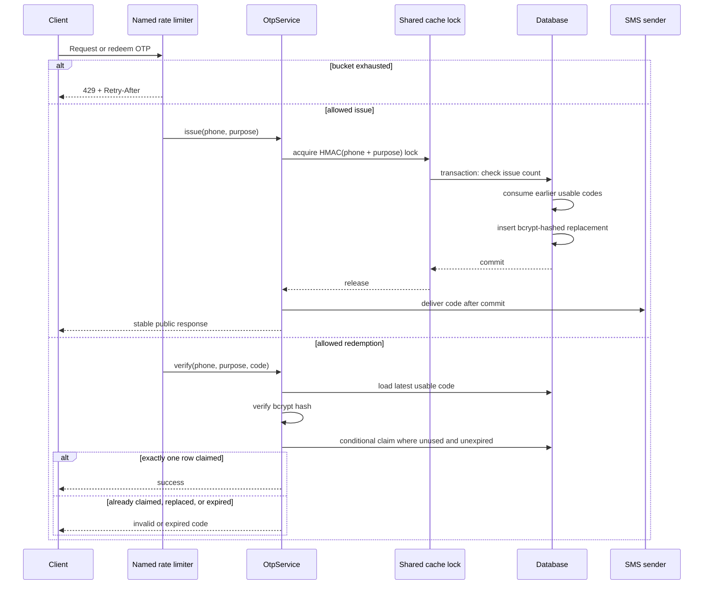
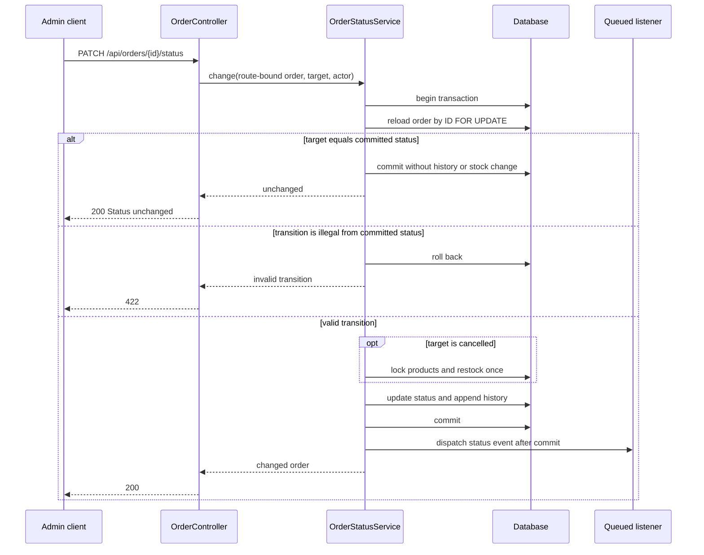
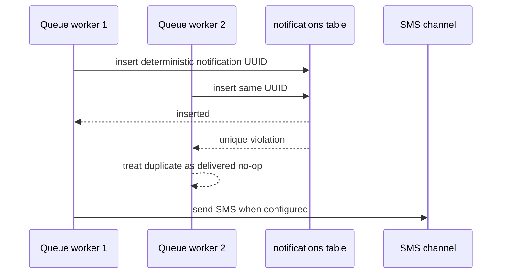

# Reliability Architecture

This document is the authoritative architecture view for the API reliability controls.
The [Postman collection](postman_collection.json) contains runnable HTTP examples, while
the [P0 feature contract](../specs/001-api-reliability-hardening/contracts/api-contract.md)
and [resilience-completion contract](../specs/002-api-resilience-completion/contracts/api-contract.md)
define the exact changed status codes, headers, and error bodies.

## Public behavior map

| Concern | Boundary | Control | Public result |
| --- | --- | --- | --- |
| Login | `POST /api/auth/login` | Five attempts per minute for both the client source and normalized phone | `429` with `Retry-After` when either bucket is exhausted |
| OTP issue | Registration, verification request, and forgot-password | Three attempts per ten minutes per phone/purpose and 20 per minute per client source | Stable `429`; public recovery/request responses do not reveal account existence |
| OTP redemption | Verification and password reset | Five attempts per minute per source and phone/purpose plus an atomic claim | One code can produce at most one successful action |
| Order retry | `POST /api/orders` with `Idempotency-Key` | Canonical SHA-256 request fingerprint stored with the key | Matching payload replays with `200`; different payload returns `409` |
| Status mutation | `PATCH /api/orders/{order}/status` | Reload and row-lock the order inside the transaction | Stale requests use committed state; duplicate status is a no-op |
| Product media | Product create, update, and delete | Transactional deletion intent plus compensating cleanup | Failed persistence keeps the referenced image; failed file deletion is retried |
| Notification retry | Queued event listeners | Deterministic database-notification UUID | Concurrent/retried delivery creates one database notification and at most one SMS attempt |
| Listing filters | `GET /api/products` and `GET /api/orders` | Dedicated Form Requests with allow-listed values | Invalid filters return `422` instead of being silently cast |
| OTP retention | Scheduler | Daily `model:prune` | Consumed or expired OTP rows older than one day are removed |
| Image cleanup | Scheduler | Five-minute `product-images:cleanup` retry | Durable pending deletions are retried idempotently |

## Reliability data model

Only the relationships involved in order replay are shown here. The important hardening
change is the `request_hash` value on every application-created idempotency record.



The unique identity is `(user_id, key)`. A fingerprint is calculated by aggregating
quantities by integer product ID, sorting by product ID, serializing fixed-key rows, and
hashing the result with SHA-256. Reordering lines or splitting one product across several
lines therefore does not change the fingerprint.

## OTP issue and redemption



Limiter and lock keys use keyed HMAC derivation; raw phone numbers are not stored in those
keys. SMS delivery occurs after the issuance transaction and lock have completed, so a
rolled-back code is never sent.

## Order placement and idempotency

```mermaid
sequenceDiagram
    participant C as Client
    participant A as OrderController
    participant O as OrderService
    participant D as Database

    C->>A: POST /api/orders + Idempotency-Key
    A->>O: place(user, items, key)
    O->>O: normalize items and calculate request hash
    O->>D: find (user_id, key)

    alt key already exists and hashes match
        D-->>O: original order
        O-->>A: replayed result
        A-->>C: 200 + Idempotency-Replayed: true
    else key already exists and hashes differ
        O-->>A: IdempotencyConflictException
        A-->>C: 409, no order or stock mutation
    else unused key
        O->>D: begin transaction
        O->>D: lock product rows in stable ID order
        alt any quantity unavailable
            O->>D: roll back
            O-->>A: insufficient stock
            A-->>C: 422, no partial mutation
        else stock available
            O->>D: create order and items; decrement stock
            O->>D: store key + request_hash + order_id
            O->>D: commit
            O-->>A: created result
            A-->>C: 201
        end
    end
```

The request hash represents the client's normalized order intent, not mutable prices,
stock, order status, or the response body. Keys longer than 64 characters are rejected
with the standard `422` validation envelope.

## Order status mutation



## Product image persistence and cleanup

The database is the source of truth for which image belongs to a product. Old image paths
are never deleted before the product transaction commits.

```mermaid
sequenceDiagram
    participant A as Admin client
    participant P as ProductImageService
    participant F as Public filesystem
    participant D as Database
    participant S as Scheduler

    A->>P: update product with replacement image
    P->>F: store new image
    P->>D: begin transaction
    P->>D: update product path
    P->>D: insert pending deletion for old path
    alt database mutation fails
        D-->>P: roll back
        P->>F: compensate new image
        P-->>A: error; old product/image remain
    else transaction commits
        D-->>P: committed
        P->>F: attempt old-image deletion
        alt deletion succeeds or file is already absent
            P->>D: remove pending deletion
        else filesystem unavailable
            P->>D: retain error and attempt count
            S->>P: product-images:cleanup
            P->>F: retry idempotently
        end
        P-->>A: successful catalogue response
    end
```

Create compensation is also tracked before deletion is attempted. If the tracking table
itself is unavailable, cleanup falls back to a best-effort direct delete without masking
the original persistence exception.

## Notification delivery deduplication

Each listener derives an RFC 4122-shaped deterministic UUID from the notification class,
recipient identity, and a stable event key (product, subscription, or status-history ID).
Laravel stores that UUID as the database notification primary key.



The database channel is deliberately first for mixed-channel notifications. A duplicate
worker cannot reach SMS. Back-in-stock subscriptions are deleted only after durable
delivery, so transient database failures remain retryable.

## Listing validation

`IndexProductsRequest` and `IndexOrdersRequest` validate all supported query fields before
controllers build their filters. Pagination is limited to 1–100 rows, pages start at one,
sort fields and directions are allow-listed, product price ranges must be coherent, and
order status must be a real `OrderStatus`. Only administrators may provide `user_id`.
Invalid input uses the standard Laravel `422` validation envelope.

## Verification and limits

Run the local acceptance gate with:

```bash
composer validate --strict --no-check-publish
composer audit --locked --no-interaction
vendor/bin/pint --test
composer test
php artisan schedule:list
```

GitHub Actions repeats the suite on SQLite, MySQL 8, and PostgreSQL 16. SQLite is the fast
local path and intentionally skips the engine-specific production concurrency test. The
MySQL and PostgreSQL jobs launch two independent PHP processes, synchronize them behind a
shared barrier, and require both the one-unit stock race and notification-deduplication
race to run without skips before the complete suite executes.

The same focused multi-process tests have been run locally against disposable MySQL 8 and
PostgreSQL 16 databases. A hosted GitHub Actions result is still a separate verification
boundary and should only be reported after the pushed workflow has completed.
